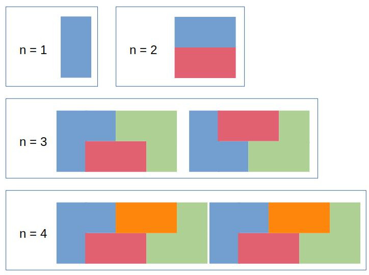

# 790 - Domino and Tromino Tiling


## Problem Description

You have two types of tiles: a $2 \times 1$ domino shape and a tromino shape. You may rotate these shapes.


> Image was taken from Leetcode. [Link to the page.](https://leetcode.com/problems/domino-and-tromino-tiling/description/)

Given an integer n, return the number of ways to tile an $2\times n$ board. Since the answer may be very large, return it modulo $10^9 + 7$.

In a tiling, every square must be covered by a tile. Two tilings are different if and only if there are two 4-directionally adjacent cells on the board such that exactly one of the tilings has both squares occupied by a tile.

## Concept
This problem can be easily solved with Dynamic Programming. Observe that the $2 \times 2$ board can be made from $2 \times 1$ by adding another **domino tile**. Similarly, $2 \times 3$ board can be made from $2 \times 2$ by adding one **domino tile** and from $2 \times 1$ with two domino tile.

## Solution

### Slower solution

Observe that we can create a $2 \times 5$ board by combining a $2 \times 1$ board by a special pattern that made from a $2 \times 4$ board. Note that we use the **special pattern** to prevent from overlapping with others. For $n \lt 3$, there is only 1 special pattern. On the other hand, for $n \ge 3$, there are 2 special patterns. See the image below.



The meaning of **special pattern**  is that the board **cannot** be made from any other board as shown in the above the image. Therefore, the number $i$ board, we have:
$$
\begin{align}
\text{num[i]} &= \sum_{j=1}^{i - 1}\text{num[j]}\times\text{spec[i - j]} \\
\text{spec[i]} &= 
\begin{cases}
2, & i \ge 3 \\
1, & otherwise 
\end{cases}
\end{align}
$$

```python
class Solution:
    def numTilings(self, n: int) -> int:
        if n == 1: return 1

        MOD = 10**9 + 7
        cur = [1, 2, 5]

        for idx in range(3, n):
            temp = 0
            for idy in range(idx):
                temp += cur[idy] * (2 if idx - idy >= 3 else 1)
            
            # Special patterns for current i
            cur.append(temp + 2)         
        
        return cur[n - 1] % MOD
```
> Time complexity: $O(n^2)$ \
> Space complexity: $O(n)$
>

### Best solution
This solution is obtained from **observing the sequence**.
$$
\begin{align}
\text{num[1]} &= 1 \\
\text{num[2]} &= 2 \\
\text{num[3]} &= 5 \\
\text{num[4]} &= 11 = 5 * 2 + 1 \\
\text{num[5]} &= 24 = 11 * 2 + 2 \\
\text{num[6]} &= 53 = 24 * 2 + 5 \\
...
\end{align}
$$

From the above example, we can easily derived that 
$$\text{num[i]} = 2 * \text{num[i - 1]} + \text{num[i - 3]}$$

```python
class Solution:
    def numTilings(self, n: int) -> int:
        if n == 1: return 1
        if n == 2: return 2

        MOD = 10**9 + 7
        cur = [1, 2, 5]
        for idx in range(3, n):
            cur.append((2 * cur[-1] + cur[-3]) % MOD)
        
        return cur[-1]
```

We can also derive the above equation from rearraging the $Eq.1$

$$
\begin{align}
\text{num[i]} &= \text{num[i - 1]} + \text{num[i - 2]} + 2 * (\text{num[i - 3]} + \cdots + \text{num[1]}) \\
&= \text{num[i - 1]} + \text{num[i - 2]} + \text{num[i - 3]}  + \text{num[i - 3]} + \\ & \ \ \ \ \ \ 2 * (\text{num[i - 4]} + \cdots + \text{num[1]}) \\
&= \text{num[i - 1]} + \text{num[i - 3]} + [\text{num[i - 2]}  + \text{num[i - 3]} + \\ & \ \ \ \ \ \ 2 * (\text{num[i - 4]} + \cdots + \text{num[1]})] \\
&= \text{num[i - 1]} + \text{num[i - 3]} + \text{num[i - 1]} \\
&= 2 \times \text{num[i - 1]} + \text{num[i - 3]}
\end{align}
$$

> Time complexity: $O(n)$ \
> Space complexity: $O(n)$


### Another awesome solution
Please visit [here](https://leetcode.com/problems/domino-and-tromino-tiling/solutions/116612/easy-to-understand-o-n-solution-with-drawing-picture-explanation/), shown by the [yuweiming70
](https://leetcode.com/yuweiming70/).